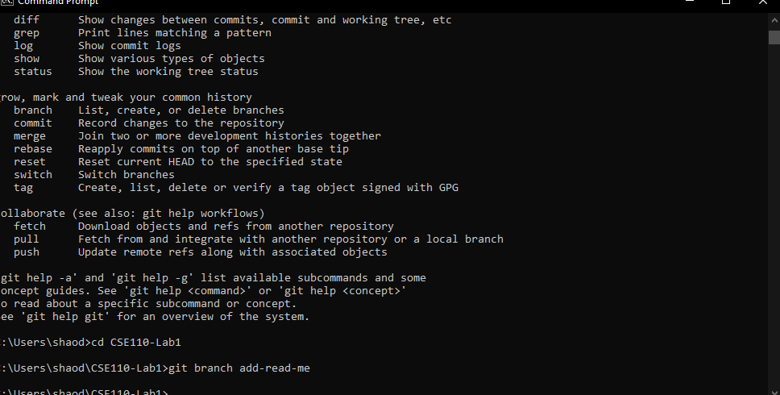
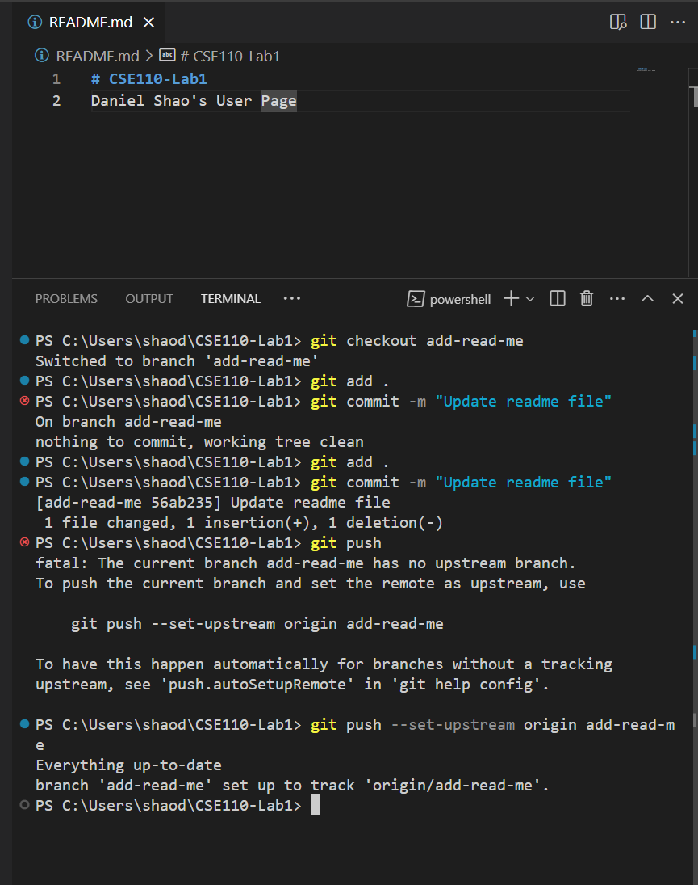
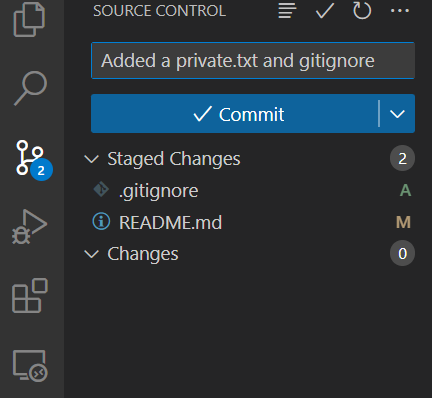

# Daniel Shao's User Page
## CSE 110, Lab 1

Hello, My name is **Daniel Shao** and I am a beginner programmer. I am currently working on first assignment for CSE 110:



> The above shows the work for this class.

Some of the commands I used were 
```
git add
git commit
git push
```

Aside from this class, I like to spend my freetime driving around and going on walks. I like using this website to find places to [travel](https://www.nps.gov/state/ca/index.htm).

Some other things I enjoy are:
- Gaming
* Reading
+ Paintballing

Mostly gaming though, and these are my top games in order:
1. League of Legends
2. TFT
3. Valorant

[README for this project](README.md)


